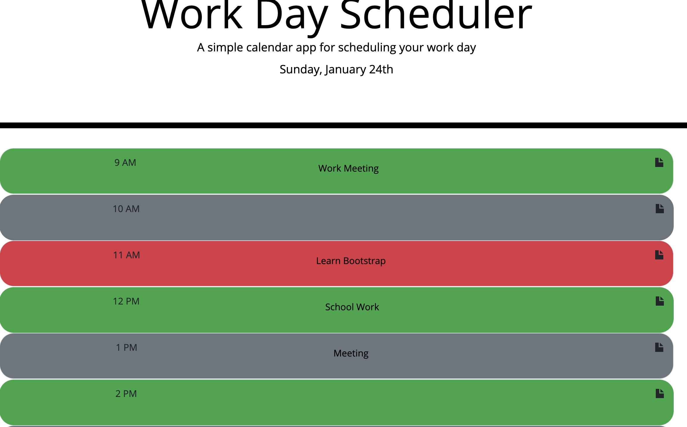

# daily-planning

This calendar application runs in the browser and is used to allow users to see their events for the day. It's color coded to inform the user of the status of each event. 

## Purpose
Each event can be edited and then you can click the save button once your new event is added.

Here's a screenshot of the application in the browser:

https://symlara.github.io/daily-planning/
